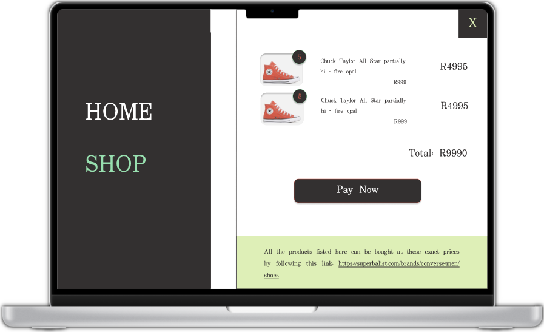

# shopping-cart

An online shopping store created in `ReactJS`.

## Core Features

- [ ] at least two pages
  - [x] homepage
  - [x] shopping page, must:
    - [x] include a shopping cart
      - [x] display the number of items currently in the shopping cart.
    - [x] have a button to go the shopping cart to checkout and pay
- [x] build individual cards for each product
  - [x] add an "add to cart" button
- [x] once the user has submitted their order the amount on the cart itself should adjust (i.e clear / reset cart).
- [x] use the React Testing Library
- [x] use the React Router to manage page changes

## Additional Features

- [x] create the not found page
  - [x] let all the other invalid /urls lead to the not found page
- [x] fetch data from an API.
- [x] keep track of state values on page change / refresh

## Design

### Homepage


### Shop page - Empty cart


### Shop page - Items in cart ( + scroll)


### Checkout page



## prototype

- Get an idea of how the finished product is meant to work
  - https://www.figma.com/proto/YsOsWHq7tPiE9Vcy3N0Bah/shopping-cart?node-id=27%3A2&scaling=scale-down&page-id=0%3A1&starting-point-node-id=2%3A2

## Preview

## Installation Instructions

- Clone the repo
- Open the the `shopping-cart` folder
- Run `npm install` to install all of the project dependecies
- Run `npm start` from your terminal
  - If your browser does not open automatically paste http://localhost:3000 in the address bar of your browser and press Enter

## Lessons Learnt

- `useHref() may be used only in the context of a Router component`

  - When trying to render the nav component in my tests I ran into the above error, resulting in my tests failing.
  - After a brief research I learnt that the above error meant that all components that use the `Link` component need to be rendered only within the Router context. Even in tests.
  - problem:
    ```js
    render(<Nav page={"home"} />);
    ```
  - solution:

    ```js
    import { BrowserRouter } from "react-router-dom";

    ...

    render(
    <BrowserRouter>
      <Nav page={"home"} />
    </BrowserRouter>
    );
    ```

## Credits

- homepage image: https://unsplash.com/photos/AZTpFmYBzzs
- favicon image: https://www.californian.co.za/wp-content/uploads/2020/11/A80-LEATHER-ALL-STAR-132173C-WHITE1.png
- product images: https://superbalist.com/brands/converse/men/shoes, all the product information is fetched from the preceding link and can be bought there.
